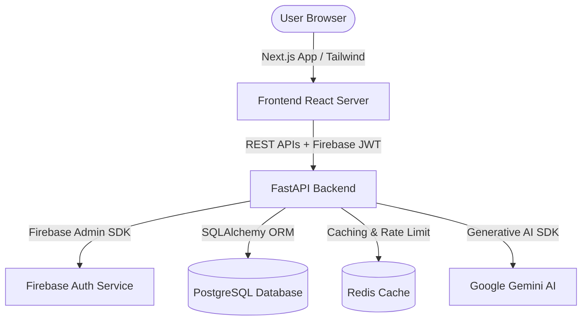

# 🌍 EcoSentinel: Carbon Footprint Awareness Platform

EcoSentinel is a state-of-the-art, premium end-to-end carbon footprint awareness, logging, and optimization platform. It helps individuals and organizations calculate, log, track, and reduce their greenhouse gas emissions through rich visualizations, live environmental reports (Air Quality Index + Weather), and AI-driven ecological advice.

---

## 🏗️ Architecture & Tech Stack

EcoSentinel is built using a clean, decoupling architecture separating the reactive frontend from a robust, production-hardened backend API.



### Frontend (`/frontend`)
*   **Framework**: Next.js 15 (App Router)
*   **Styling**: Tailwind CSS & Vanilla CSS (Harmonious Dark Theme, Sleek Micro-animations, Glassmorphism UI)
*   **State & Queries**: React Query (TanStack Query)
*   **Security & Auth**: Firebase Authentication & Context-driven User Sessions
*   **Testing**: Vitest + React Testing Library

### Backend (`/backend`)
*   **Framework**: FastAPI (Python 3.12+)
*   **Design Pattern**: Clean Architecture (Domain, Use Cases, Interfaces/API, Infrastructure layers)
*   **Database ORM**: SQLAlchemy 2.0 with Alembic migrations
*   **Databases**: PostgreSQL (primary store) & Redis (session cache and rate limiting)
*   **Security Middleware**: Firebase JWT Token verification, SlowAPI (Rate Limiter), CORS headers
*   **AI Engine**: Google Gemini AI (Generative advice & emission reduction plans)

---

## ⚡ Quick Start

### Prerequisites
*   [Docker](https://www.docker.com/) & Docker Compose (Recommended)
*   OR local runtimes: Python 3.12+ and Node.js 18+

### Setup and Running with Docker Compose (Recommended)
This launches the frontend, backend, PostgreSQL, and Redis databases in containers automatically:

```bash
# Start all containers
docker-compose up --build

# Shutdown containers and clean volumes
docker-compose down -v
```

*   **Frontend URL**: http://localhost:3000
*   **Backend URL**: http://localhost:8000
*   **API Documentation (Swagger)**: http://localhost:8000/docs

---

### Local Installation (Alternative)

A unified [`Makefile`](file:///Users/sakthi/Carbon%20Footprint%20Awareness%20Platform/Makefile) is provided to make local setup and running easy.

#### 1. Setup Dependencies
```bash
make setup
```

#### 2. Environment Variables Configuration
Create the configurations from the template files:
```bash
# Backend configurations
cp backend/.env.example backend/.env

# Frontend configurations
cp frontend/.env.example frontend/.env.local
```

#### 3. Run Development Servers
Open two terminal windows or run in background:
```bash
# Start frontend dev server (port 3000)
make dev-fe

# Start backend dev server (port 8000)
make dev-be
```

---

## 🛠️ Makefile Commands Cheat Sheet

| Command | Description |
| :--- | :--- |
| `make setup` | Install both frontend and backend dependencies locally |
| `make dev-fe` | Spin up the Next.js frontend development server |
| `make dev-be` | Spin up the FastAPI backend reload server |
| `make test-be` | Run pytest backend suite with coverage checks |
| `make typecheck-fe` | Typecheck frontend code |
| `make docker-up` | Build and start Docker containers |
| `make docker-down` | Tear down Docker containers and volumes |
| `make format-be` | Automatically format Python code using Black & Ruff |
| `make lint` | Verify lint rules on backend (Ruff) and frontend (ESlint) |

---

## 🎨 Visual Features & Theme Design

EcoSentinel features a **curated dark-mode layout** utilizing rich gradients, clear micro-interactions, and premium components:
*   **Dashboard**: Offers live metric calculations, scope distribution charts, and trends.
*   **Environmental Insights**: Displays real-time AQI reports, weather conditions, and green tips.
*   **AI Advisor**: Connects directly with the Gemini model to suggest dynamic, action-oriented reduction plans.
*   **Log Emissions**: Structured form logging for transport, energy, and waste outputs.
