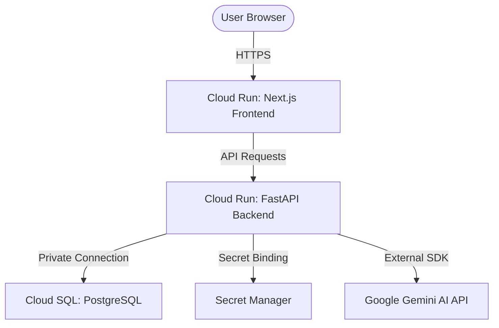

# ☁️ Deploying EcoSentinel to Google Cloud Platform (GCP)

This guide provides a comprehensive walkthrough to deploy the EcoSentinel Carbon Footprint Awareness Platform to Google Cloud using **Google Cloud Run** (for serverless containers) and **Google Cloud SQL** (for managed PostgreSQL database).

---

## 🏗️ Target GCP Architecture



---

## 📋 Prerequisites

1.  **Google Cloud Project**: Create a project in the [Google Cloud Console](https://console.cloud.google.com/).
2.  **gcloud CLI**: Install and authenticate the gcloud CLI locally:
    ```bash
    gcloud auth login
    gcloud config set project YOUR_PROJECT_ID
    ```
3.  **Docker**: Ensure Docker is running locally (only needed if building images locally; otherwise Cloud Build handles it).

---

## 🛠️ Step 1: Enable Google Cloud Services

Run the following command to enable the necessary APIs for deployment:

```bash
gcloud services enable \
    run.googleapis.com \
    sqladmin.googleapis.com \
    secretmanager.googleapis.com \
    artifactregistry.googleapis.com \
    cloudbuild.googleapis.com
```

---

## 🗄️ Step 2: Set Up Managed Database (Cloud SQL)

1.  **Create a Cloud SQL Instance**:
    ```bash
    gcloud sql instances create ecosentinel-db \
        --database-version=POSTGRES_15 \
        --tier=db-f1-micro \
        --region=asia-south1
    ```
2.  **Set Database Password**:
    ```bash
    gcloud sql users set-password postgres \
        --instance=ecosentinel-db \
        --password=YOUR_SECURE_PASSWORD
    ```
3.  **Create Application Database**:
    ```bash
    gcloud sql databases create ecosentinel \
        --instance=ecosentinel-db
    ```

---

## 🔑 Step 3: Configure Secret Manager

Store sensitive secrets in Secret Manager to keep them out of environment variables:

1.  **Create Secrets**:
    ```bash
    # Database URL Secret
    echo -n "postgresql://postgres:YOUR_SECURE_PASSWORD@/ecosentinel?host=/cloudsql/YOUR_PROJECT_ID:asia-south1:ecosentinel-db" | \
    gcloud secrets create DATABASE_URL --data-file=-

    # Gemini API Key Secret
    echo -n "YOUR_GEMINI_API_KEY" | \
    gcloud secrets create GEMINI_API_KEY --data-file=-

    # Firebase Service Account JSON Secret
    gcloud secrets create FIREBASE_SERVICE_ACCOUNT_KEY --data-file=backend/firebase-key-if-any.json
    ```

---

## ⚙️ Step 4: Deploy the FastAPI Backend to Cloud Run

1.  **Create Artifact Registry Repository**:
    ```bash
    gcloud artifacts repositories create ecosentinel-repo \
        --repository-format=docker \
        --location=asia-south1 \
        --description="Docker repository for EcoSentinel"
    ```

2.  **Build and Push Backend Image**:
    ```bash
    gcloud builds submit backend/ \
        --tag asia-south1-docker.pkg.dev/YOUR_PROJECT_ID/ecosentinel-repo/backend:latest
    ```

3.  **Deploy Backend to Cloud Run**:
    ```bash
    gcloud run deploy ecosentinel-backend \
        --image=asia-south1-docker.pkg.dev/YOUR_PROJECT_ID/ecosentinel-repo/backend:latest \
        --region=asia-south1 \
        --add-cloudsql-instances=YOUR_PROJECT_ID:asia-south1:ecosentinel-db \
        --set-env-vars="ENVIRONMENT=production,DEBUG=false,FIREBASE_PROJECT_ID=ecosentinel-31c16" \
        --set-secrets="DATABASE_URL=DATABASE_URL:latest,GEMINI_API_KEY=GEMINI_API_KEY:latest,FIREBASE_SERVICE_ACCOUNT_KEY=FIREBASE_SERVICE_ACCOUNT_KEY:latest" \
        --allow-unauthenticated
    ```

> 📝 **Note**: Copy the **Service URL** printed after the deployment completes. This will be your backend API URL (e.g., `https://ecosentinel-backend-xxxxxx.a.run.app`).

---

## 🎨 Step 5: Deploy the Next.js Frontend to Cloud Run

1.  **Build and Push Frontend Image**:
    Here, the frontend needs to know where the backend API URL is during build-time (static environment variables):
    ```bash
    gcloud builds submit frontend/ \
        --config=cloudbuild-frontend.yaml \
        --tag asia-south1-docker.pkg.dev/YOUR_PROJECT_ID/ecosentinel-repo/frontend:latest
    ```

2.  **Deploy Frontend to Cloud Run**:
    ```bash
    gcloud run deploy ecosentinel-frontend \
        --image=asia-south1-docker.pkg.dev/YOUR_PROJECT_ID/ecosentinel-repo/frontend:latest \
        --region=asia-south1 \
        --set-env-vars="NEXT_PUBLIC_FIREBASE_API_KEY=AIza...,NEXT_PUBLIC_API_URL=https://ecosentinel-backend-xxxxxx.a.run.app/api/v1" \
        --allow-unauthenticated
    ```

---

## 🤖 Step 6: Automating Builds (`cloudbuild-frontend.yaml`)

Create a local Cloud Build configurations file for building the frontend. This injects target URLs before compiling the React bundle:

Create the file [`cloudbuild-frontend.yaml`](file:///Users/sakthi/Carbon%20Footprint%20Awareness%20Platform/cloudbuild-frontend.yaml):

```yaml
steps:
  - name: 'gcr.io/cloud-builders/docker'
    args:
      - 'build'
      - '--build-arg'
      - 'NEXT_PUBLIC_API_URL=https://ecosentinel-backend-xxxxxx.a.run.app/api/v1'
      - '-t'
      - '$_IMAGE_NAME'
      - '.'
images:
  - '$_IMAGE_NAME'
```
